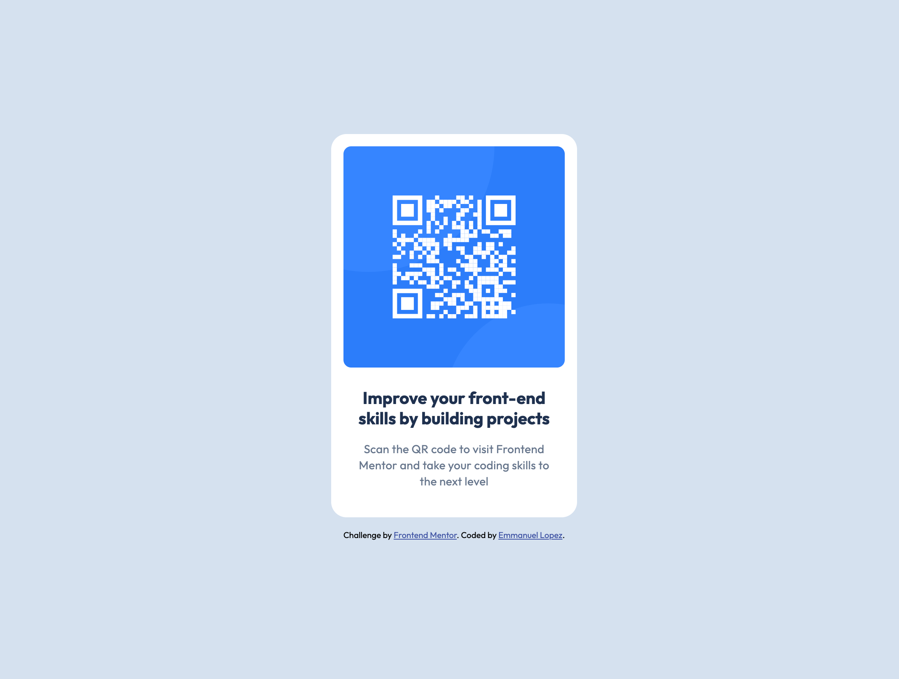

# Frontend Mentor - QR code component solution

This is a solution to the [QR code component challenge on Frontend Mentor](https://www.frontendmentor.io/challenges/qr-code-component-iux_sIO_H). Frontend Mentor challenges help you improve your coding skills by building realistic projects.

## Table of contents

-   [Frontend Mentor - QR code component solution](#frontend-mentor---qr-code-component-solution)
    -   [Table of contents](#table-of-contents)
    -   [Overview](#overview)
        -   [Screenshot](#screenshot)
        -   [Links](#links)
    -   [My process](#my-process)
        -   [Built with](#built-with)
        -   [What I learned](#what-i-learned)
        -   [Continued development](#continued-development)
    -   [Author](#author)

## Overview

### Screenshot

### Links

-   Solution URL: [Github](https://github.com/EmLopezDev/QR-Code-Component)
-   Live Site URL: [Github Pages](https://emlopezdev.github.io/QR-Code-Component/)

## My process

-   Focused first on using semantic html
-   Then made sure to follow the design in figma to style the component according to that design

### Built with

-   Semantic HTML5 markup
-   CSS with custom variables
-   Flexbox

### What I learned

One thing I am starting to do more of is taking the approach a step at a time. Meaning first focusing on getting the HTML right before even adding CSS. Also although very little color was used, I am making it a habit to do CSS variable to make it easier for any future modifications. Finally using rem instead of px for font sizing.

### Continued development

I am going to continue on working on creating layouts that match the design which will make me better at reading Figma designs.

## Author

-   Website - [Emmanuel Lopez](https://github.com/EmLopezDev)
-   Frontend Mentor - [@EmLopezDev](https://www.frontendmentor.io/profile/EmLopezDev)
